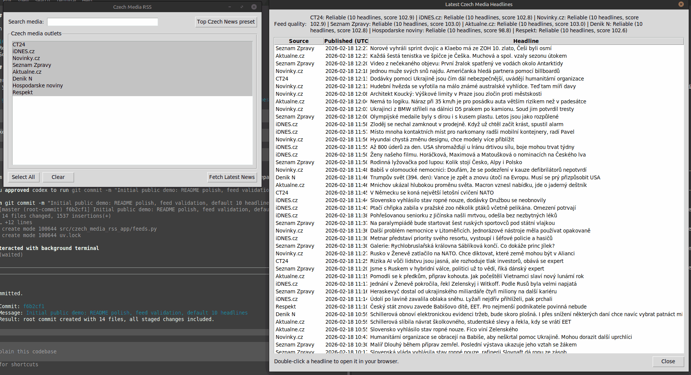

# Czech + Slovak Media RSS (Tkinter desktop app)

Small desktop app for browsing recent headlines from Czech and Slovak media outlets via RSS.

Showcases capability of GPT-5.3 Codex + agent personas from <https://github.com/N4M3Z/forge-council> to quickly build functional app. App prepared by installing forge-council, enabling `/experimental` Multi-agents feature and Linux Bubblewrap sandbox, invoking `$Council "short prompt to make this app..."` `$Council` should "Convene a PAI-style council - 3-round debate where specialists challenge each other."

See [CHANGELOG.md](CHANGELOG.md) for release history.



## What it does

- Shows searchable multi-select sources with country filtering (`ALL`, `CZ`, `SK`).
- Includes one-click presets:
  - `Top Czech News`
  - `Top Slovak News`
  - `Top CZ + SK`
- Tries multiple feed candidates per source and chooses the best one using deterministic scoring.
- Fetches in the background and supports cancellation.
- Displays per-source quality and headline results directly in the main window.
- Opens article links in your default browser on double-click.

Default download limit is **10 headlines per source**.

## UI flow

1. Select country scope and optional preset.
2. Select one or more sources from the left panel.
3. Click `Fetch Latest News`.
4. Inspect quality table and headlines on the right panel.
5. Double-click any headline to open it in browser.

## Status legend

- `Reliable`: strong feed quality and sufficient recent items.
- `Partial`: feed is reachable but quality/volume is limited.
- `Unavailable`: all configured candidates failed.

## Requirements

- Python `>=3.10`
- `feedparser`, `requests`
- `tkinter` (OS package on many Linux distributions)

If `tkinter` is missing:

- Debian/Ubuntu: `sudo apt install python3-tk`
- Fedora: `sudo dnf install python3-tkinter`
- Arch: `sudo pacman -S tk`

## Quick start (uv)

```bash
uv venv
source .venv/bin/activate
uv pip install -r requirements.txt
./czech-media-rss
```

Alternative install path:

```bash
uv venv
source .venv/bin/activate
uv sync
uv run python -m czech_media_rss_app.app
```

After `uv` setup, you can use the wrapper `./czech-media-rss` for quick app launch.
It runs `uv run czech-media-rss` from the project root and forwards any optional args.

## Feed validation

Run a fresh check of configured feed candidates in the uv-managed environment:

```bash
uv run python3 scripts/validate_feeds.py --json-out reports/feed_validation_latest.json
```

Published validation artifacts:

- `reports/feed_validation_latest.json`

## Notes

- RSS feeds are third-party endpoints and can change or become unavailable.
- Feed quality and ordering are heuristic (best candidate per source, not a guarantee).
- Slovak feeds are supported as optional sources and should be periodically re-validated.

## License

Licensed under **EUPL 1.2**. See `LICENSE`.
